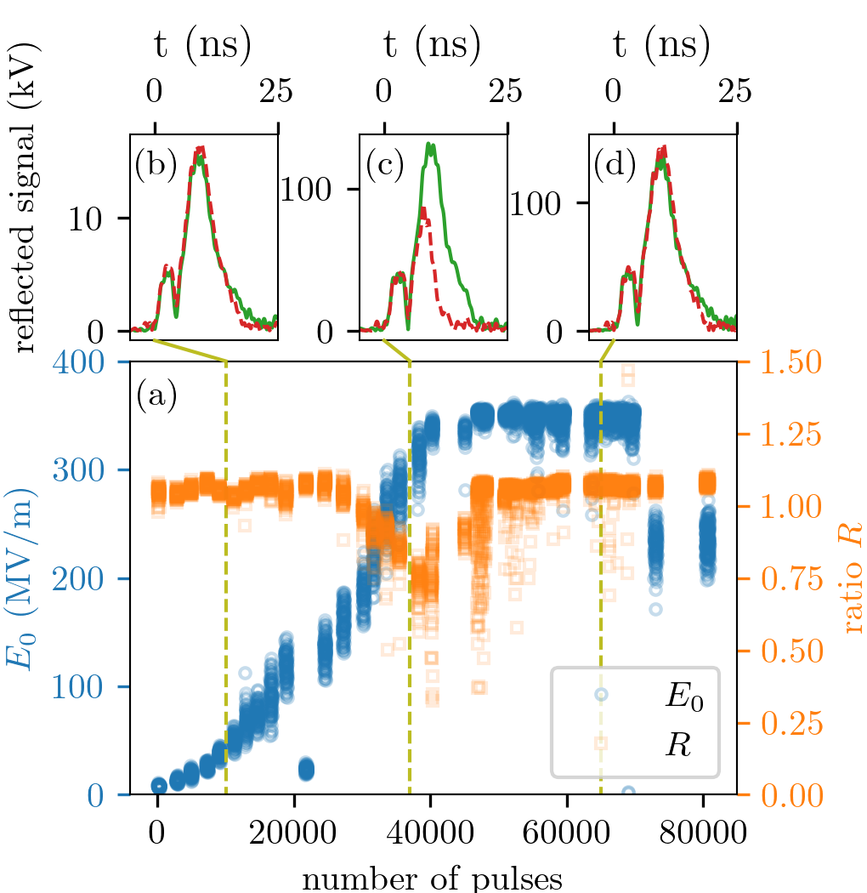

This subdirectory contains data to regerate the composite figure shown below and appearing as Fig. 4 of the paper   ["Demonstration of sub-
GV/m accelerating field in a photoemission electron gun powered by nanosecond X-band radio-frequency pulses" by W.H. Tan et al.](https://journals.aps.org/prab/abstract/10.1103/PhysRevAccelBeams.25.083402)
<figure>
  
  <figcaption>
  labelname :: This is the label text.
  </figcaption>
</figure>
